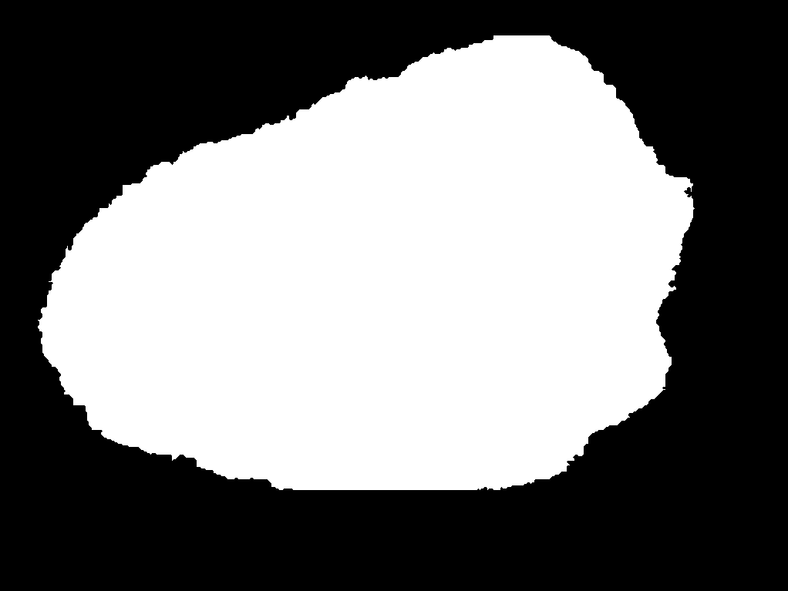

# Skin-Lesion-Segmentation-in-TensorFlow-2.0

This repository contains the code for semantic segmentation of the skin lesions on the ISIC-2018 dataset using TensorFlow 2.0 framework.
The following models are used:
- [UNET](https://arxiv.org/abs/1505.04597)
- [RESUNET](https://arxiv.org/pdf/1711.10684.pdf)

Models to be used in future:
- 
- DEEPLABV3+
- more...

# Dataset
The ISIC-2018 dataset is used for this for training the UNET architecture. The dataset contains the 2596 pairs of images and masks. All of these images are of different shapes and contains a variety of skin lesions.

Original Image             |  Mask Image
:-------------------------:|:-------------------------:
  |  
